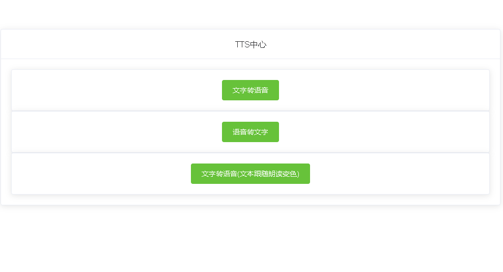
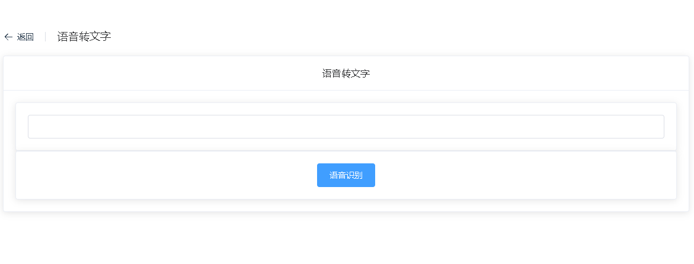

# WEB_TTS

## 介绍

- TTS TTS（Text-to-Speech）是一种技术，它将文本转换为语音,或语音转换为文本
- 使用 web 自带的 tts，实现语音转文本，文本转语音

## 项目截图

- 主入口
  
- 文字转语音
  
- 语音转文字
  
- 文字转语音-文本跟随语音变色
  

## 项目部署

- 执行命令,安装依赖

```
npm install
```

- 启动项目命令

```
npm run serve
```

- 构建项目命令

```
npm run build
```

- 修复代码 lint 错误命令

```
npm run lint
```

## Version 版本

- 1.0 新增语音文本互转功能
- 1.1 新增文本转语音 Plus: 文本跟随朗读部分变色

## 注意事项
* 如果语言转文字报错，请检查电脑麦克风是否打开
